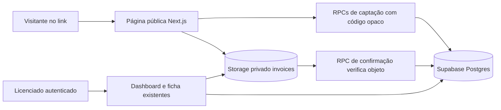

# Growth — captação pública e revisão de oportunidades

- **Data:** 2026-09-24
- **Status:** proposta para aprovação; nenhuma implementação autorizada ainda
- **Preço-alvo do plano:** R$ 247/mês, sem cobrança nesta entrega
**Proposta de valor:** “Uma operação comercial organizada para encontrar, qualificar, apresentar e acompanhar clientes de energia.”

## 1. Contexto e resultado esperado

O licenciado iGreen já consegue encontrar empresas pelo Google Places, cadastrar e acompanhar leads, organizar tarefas, receber faturas no fluxo autenticado, calcular estimativas de economia e preparar mensagens para WhatsApp. O dashboard resume leads, etapas, faturas cadastradas, economia estimada e tarefas do dia. A aplicação usa Next.js App Router, Supabase Auth/Postgres/Storage, RLS por organização e bucket privado `invoices`.

Falta um meio para a própria empresa enviar seus dados e sua fatura ao workspace do licenciado. Hoje o upload exige login e dados técnicos da fatura; `invoices` exige valor, consumo, distribuidora, UF, tipo de cliente e referência. Também não há origem `PUBLIC_LINK`, fila de revisão, evidência de consentimento nem indicador de entradas por link. O produto ainda não gera uma proposta comercial formal; existem simulação e texto para contato. Esta versão melhora a entrada e o acompanhamento sem prometer vendas, economia confirmada ou proposta automática.

**Resultado da primeira versão:** um licenciado compartilha um link próprio; a empresa envia identificação, contato e fatura; a entrada aparece no workspace certo como oportunidade `NOVO`; o licenciado revisa os dados, completa os dados da fatura, executa a simulação existente e acompanha o próximo contato em tarefa. Sucesso de produto deve ser observado por entradas com fatura, tempo até primeira revisão e proporção de oportunidades que avançam após revisão, sem tratar esses números como garantia de venda.

## 2. Abordagens consideradas

| Abordagem | Vantagem | Custo e risco | Decisão |
| --- | --- | --- | --- |
| A. Endpoint Next.js com chave `service_role` no servidor e URL assinada para upload | Menos SQL de autorização pública | A chave contorna RLS e contraria a regra atual do README; qualquer erro no endpoint pode cruzar organizações | Não recomendar |
| B. Política de upload anônimo por pasta da organização | Implementação curta | Uma pasta pública permite arquivos e tentativas sem relação com uma solicitação válida | Rejeitar |
| C. Link opaco + RPCs restritas + autorização de upload por caminho único | Mantém `service_role` fora do aplicativo, preserva RLS dos membros e permite envio direto de até 10 MB ao bucket privado | Exige migração pequena e dois passos de envio, com recuperação de falhas | **Recomendada** |

A opção C é o menor corte que entrega um envio real de 10 MB no ambiente Vercel: arquivos seguem do navegador para o Supabase Storage, sem atravessar o corpo de uma Vercel Function, cujo limite é 4,5 MB. A permissão pública de escrita vale apenas para um caminho aleatório emitido para uma solicitação ativa. O servidor e o banco nunca aceitam `organization_id` indicado pelo visitante como autoridade.

## 3. Escopo da versão vertical

1. Configurações mostram ao owner o link `/captar/[codigo]`, com ações de copiar, desativar e gerar outro código. A página pública mostra apenas o nome da organização e o formulário; link inexistente ou desativado não revela dados do workspace.
2. Formulário exige empresa, telefone, cidade, e-mail, aceite explícito de contato e tratamento da fatura e arquivo PDF/JPG/PNG de até 10 MB. O texto de consentimento aponta para a política de privacidade e tem versão registrada. Não há campo de UF na captação; o licenciado informa UF na revisão.
3. Ao iniciar o envio, cria-se uma oportunidade `NOVO`, `source = PUBLIC_LINK`, `created_by = null`, uma atividade de origem e uma tarefa `FOLLOW_UP` pendente para o owner, com vencimento imediato e instrução de revisar e contatar. A oportunidade aparece mesmo se o upload falhar, identificada como “fatura pendente”; o visitante só recebe confirmação de envio completo depois que o arquivo for verificado.
4. O arquivo é enviado diretamente ao bucket privado `invoices` sob um caminho exclusivo da organização e da oportunidade. Uma confirmação idempotente verifica a presença do objeto antes de marcar a fatura como recebida. Falha de rede oferece tentativa de envio/confirmação sem criar outra oportunidade na mesma sessão; a ficha permite reconciliar um upload concluído cuja confirmação falhou.
5. Dashboard mostra quantidade de entradas por link ainda não revisadas e uma lista curta com empresa, data, estado da fatura e acesso à oportunidade. A lista de leads e o detalhe identificam a origem. Pipeline e etapas atuais permanecem iguais.
6. Na ficha, o licenciado pode marcar a entrada como revisada. Na página de fatura, ele abre o arquivo com URL assinada curta, informa os campos técnicos e confirma esses dados. Essa confirmação cria uma linha em `invoices` usando o arquivo já recebido; não pede novo upload. Em seguida, a simulação atual e as ações de WhatsApp continuam disponíveis. A tarefa criada pode ser concluída pelo fluxo existente.
7. Uma entrada repetida da mesma empresa gera uma oportunidade distinta, para não descartar fatura ou consentimento. A revisão mostra possíveis duplicatas da mesma organização para decisão humana; não há fusão automática nem exposição de existência ao visitante.

Ficam fora de escopo OCR, WhatsApp Business API, anúncios pagos, pagamentos, IA autônoma, proposta PDF, mudança de etapas do pipeline, alteração da busca Places, criação de equipes e refatoração geral.

## 4. Arquitetura e responsabilidades

- **Página pública Next.js:** renderização por solicitação, validação amigável e estados de envio. Usa cliente Supabase sem cookies de sessão do licenciado. Nenhum arquivo passa por Server Action ou Route Handler.
- **RPCs públicas:** `public_link_details`, `begin_public_intake` e `finish_public_intake`. São funções `SECURITY DEFINER` de assinatura estrita, com `search_path` seguro, referências de schema explícitas, `EXECUTE` revogado de `PUBLIC` e concedido apenas a `anon` onde necessário. Os campos de lead, atividade e tarefa são definidos no banco; não há payload genérico de SQL/JSON com colunas arbitrárias. O código opaco resolve a organização. A operação de início é transacional.
- **Storage:** bucket existente continua privado. Uma nova política `INSERT TO anon` autoriza somente o caminho exato, de alta entropia, de uma captação pendente e dentro do prazo; `upsert` é proibido. `anon` não recebe leitura, listagem, atualização nem exclusão. As políticas atuais de membros continuam por pasta da organização.
- **Fluxo autenticado:** dashboard, ficha e confirmação dos dados da fatura usam a sessão e `organization_id` obtidos por `getCurrentContext()`, mais RLS. Uma operação transacional específica associa o arquivo público a `invoices` uma única vez e grava atividade; a simulação não é alterada.

Antes da implementação, validar com o Supabase do projeto que a política de `storage.objects` aceita o upload direto com papel `anon` e que a RPC de confirmação consegue verificar o objeto sem conceder leitura pública. Se isso não for suportado, trazer a mudança de arquitetura para nova aprovação; não abrir leitura anônima nem incluir `service_role` como correção implícita.

## 5. Dados e migração proposta

| Estrutura | Campos e regras principais |
| --- | --- |
| `public_intake_links` | `id`, `organization_id` FK, `code` aleatório com pelo menos 128 bits de entropia e índice único, `active`, `expires_at` opcional, `created_at`, `revoked_at`. Um link ativo por organização na V1; apenas owner gerencia. O código é uma capacidade para enviar, nunca uma permissão de leitura. |
| `public_intake_submissions` | `id`, `organization_id`, `link_id`, `lead_id` único, `consent_at`, `consent_version`, `consent_text`, `upload_path` único, `upload_expires_at`, `upload_state` (`PENDENTE`/`RECEBIDO`), `original_filename`, `mime_type`, `reviewed_at`, `reviewed_by`, `invoice_id` opcional, `created_at`. FK composta `(lead_id, organization_id)` e vínculo de `invoice_id` com a mesma organização protegem relações. |
| `leads` | Usa colunas atuais: nome, telefone, cidade, e-mail, `source = PUBLIC_LINK`, `pipeline_status = NOVO`, `created_by = null`, `external_place_id = null`. `fingerprint = public:<submission_id>` evita conflito com o índice único de importação; duplicatas são revistas por pessoa. |
| `tasks` e `lead_activities` | Uma tarefa `FOLLOW_UP` do owner e uma atividade `LEAD_CRIADO` com origem pública, criadas na mesma transação da oportunidade. |
| `invoices` | Nenhum placeholder de valor ou consumo. Só ganha linha após revisão manual, com dados técnicos válidos e caminho já recebido. Associação idempotente por `submission_id`/`invoice_id`; impedir segundo cadastro do mesmo arquivo. |

Ativar RLS na nova tabela de submissões. Membros da organização podem ler e marcar revisão; visitantes não podem fazer `SELECT` em submissões, leads, tarefas ou arquivos. Gerenciamento de links limitado ao owner. RPCs só retornam dados mínimos: detalhes públicos do workspace, identificador opaco da tentativa, caminho de upload e status de confirmação. Não retornam `lead_id` nem registros privados ao visitante. Os tipos de banco precisam ser atualizados junto à migração.

## 6. Fluxos, erros e limites

**Criar e compartilhar link.** O owner gera ou copia o endereço. Desativar ou rotacionar bloqueia novos envios pelo código anterior; oportunidades existentes permanecem no CRM. O formulário não consulta Google Places, não associa `place_id` e não persiste conteúdo da API Google.

**Receber.** Validar campos e arquivo no cliente para feedback e novamente na RPC/política/bucket. Ao iniciar, o banco confere link ativo, consentimento `true`, versão do texto, limites de campo, MIME/extensão e cota de solicitações do link. Limite inicial: 20 inícios por hora e 100 por dia por link, aplicado na RPC com bloqueio da linha do link durante a contagem para que chamadas diretas ou simultâneas não escapem do limite. A resposta de excesso não informa dados internos. Criar a oportunidade e tarefa em transação; emitir caminho `organization_id/submission_id/<segredo>.<ext>` válido para um único objeto por 30 minutos. O caminho não contém o ID do lead. O arquivo vai direto ao Storage. A RPC final verifica bucket, caminho, tamanho e MIME gravados pelo Storage e troca o estado para `RECEBIDO`; chamadas repetidas devolvem o mesmo resultado. A UI confirma somente depois disso.

**Falhas.** Se o upload ou a finalização falhar, a oportunidade fica visível com estado `PENDENTE`; a UI mantém os dados e oferece retentativa enquanto a autorização estiver válida. Expirado o prazo, o visitante recebe instrução para fazer novo envio ou contatar o licenciado; a oportunidade anterior continua para revisão, sem link público de consulta. O licenciado pode marcar entradas incompletas como revisadas e usar a tarefa para pedir a fatura. Objeto enviado cuja confirmação falhou pode ser reconciliado por ação autenticada do licenciado, após conferir a presença no Storage. A remoção de dados/arquivos abandonados seguirá o prazo e processo publicados na política de privacidade antes de abrir a captação ao público; a V1 deve incluir um procedimento operacional documentado de limpeza, sem prometer retenção automática que não existe.

**Revisar e simular.** A ficha mostra o arquivo pendente/recebido e o consentimento (data/versão), sem expor o código de upload. Confirmar os dados técnicos valida valores como o upload autenticado atual, confere organização e arquivo, cria `invoices` e atividade `FATURA_ADICIONADA` uma vez. O licenciado executa a simulação existente; nenhuma estimativa é exibida ao visitante antes da revisão. Marcar revisão não altera automaticamente o estágio comercial. O contato, o avanço no pipeline e a conclusão da tarefa continuam decisões do licenciado.

**Privacidade e abuso.** Texto de consentimento separado do botão de envio, checkbox desmarcado por padrão, política acessível e prova de versão/hora. Evitar dados pessoais, código do link e caminho do arquivo em logs, analytics e mensagens de erro. A página pública não indexa URLs de captação. Limites por link reduzem abuso, mas não substituem defesa contra ataques distribuídos; o owner consegue desativar o link. Antes de divulgação pública, preencher identificação do controlador, contato e política de retenção/exclusão nos documentos existentes, que ainda trazem avisos de versão inicial.

## 7. Critérios de aceite

1. Cada organização tem link próprio; código inválido, expirado ou desativado não cria oportunidade e não revela workspace, leads nem arquivos.
2. Empresa, telefone, cidade, e-mail e checkbox de consentimento são obrigatórios; texto, data/hora e versão do aceite ficam registrados quando a solicitação válida é iniciada, inclusive se o arquivo terminar pendente.
3. PDF/JPG/PNG de até 10 MB chega ao bucket privado no caminho da organização correta. Tipo, extensão, tamanho e objeto ausente são rejeitados. Visitante não consegue listar, ler, alterar ou remover arquivos.
4. O início cria exatamente uma oportunidade `NOVO` com origem `PUBLIC_LINK`, atividade e tarefa; repetição da finalização não cria duplicatas. Falha do arquivo deixa estado pendente explícito e recuperação possível.
5. O dashboard do licenciado mostra entradas pendentes e recebidas daquele workspace, com acesso à ficha. Outro licenciado não vê esses registros nem indicadores.
6. A revisão usa o arquivo enviado, permite preencher os dados técnicos e cria uma única `invoice`. A simulação atual funciona a partir dela; a tarefa pode ser concluída no fluxo atual.
7. O pipeline, importação do Google Places, upload autenticado de fatura e mensagens existentes continuam funcionando sem mudança de semântica.
8. Cota por link, desativação do link e respostas de erro não permitem inferir informações de outra organização.
9. A interface pública é utilizável por teclado, informa progresso/erro em texto e não afirma venda, elegibilidade ou economia garantida.

## 8. Testes e validação após aprovação

- **Unidade:** schema do formulário, telefone/e-mail/consentimento, tipos e limites de arquivo, formação de caminho, estados de início/finalização e resumo do dashboard.
- **Integração SQL/Storage com duas organizações e papel `anon`:** código A cria apenas em A; código B apenas em B; código forjado/inativo falha; RLS impede A de ler ou atualizar B; `anon` não lê tabelas/objetos e só insere no caminho autorizado; expirado, repetido, MIME/tamanho incorretos falham; finalização exige objeto real e é idempotente.
- **Integração do fluxo autenticado:** submissão com consentimento e arquivo → dashboard → revisão → dados da fatura → simulação → tarefa concluída. Verificar também falha de upload e retentativa sem segunda oportunidade.
- **Regressão:** testes atuais, `npm run lint`, `npm run typecheck`, `npm run build`, upload autenticado, importação Places e pipeline. Teste manual de dois workspaces e URLs assinadas com expiração.

Não declarar pronto apenas por mocks: a política de Storage e o isolamento precisam ser exercitados em Supabase real ou ambiente local com migrations aplicadas. Publicação do link fica condicionada à revisão dos textos de privacidade e do procedimento de exclusão.

## 9. Sequência de entrega após aprovação

Migração e políticas → testes de isolamento/Storage → página e envio público → dashboard e ficha → confirmação de dados da fatura e revisão → testes ponta a ponta. A migração deve chegar antes do código que depende dela. O lançamento pode começar com um único workspace piloto, sem ativar automaticamente links para todos.

## Referências verificadas

- Documentos locais: `README.md`, `AGENTS.md`, `docs/superpowers/specs/2026-09-22-igreen-mvp-design.md`, `docs/superpowers/specs/2026-09-23-prospecting-lead-flow-design.md`, `docs/acceptance-checklist.md` e as migrations atuais.
- [Vercel Functions: limite de payload](https://vercel.com/docs/functions/limitations).
- [Supabase: funções de banco e permissões](https://supabase.com/docs/guides/database/functions), [Storage privado e restrições de bucket](https://supabase.com/docs/guides/storage/buckets/fundamentals) e [RLS](https://supabase.com/docs/guides/database/postgres/row-level-security).
- Guias locais da versão instalada de Next.js: `node_modules/next/dist/docs/01-app/01-getting-started/15-route-handlers.md`, `02-guides/forms.md` e `02-guides/data-security.md`.
